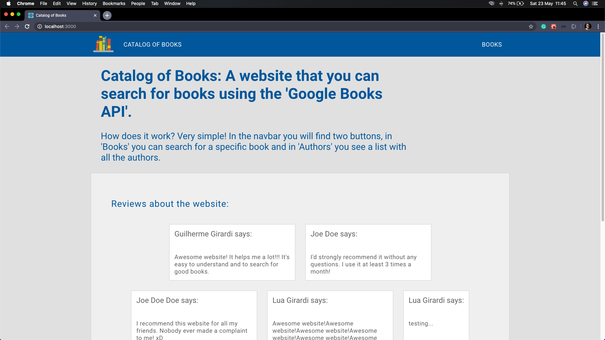
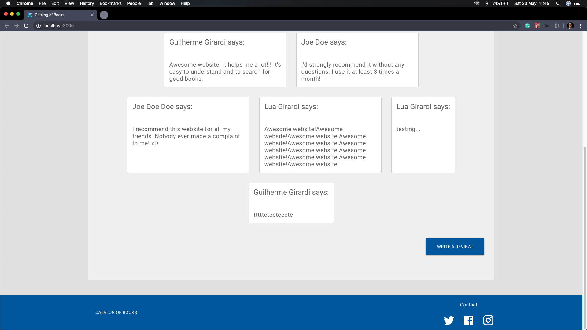
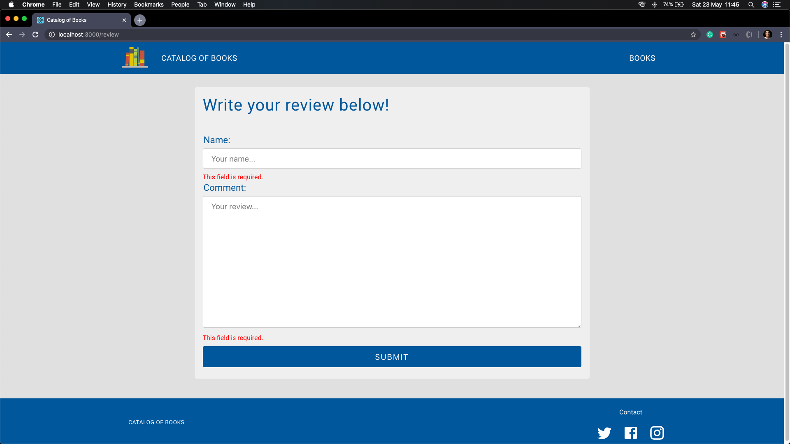
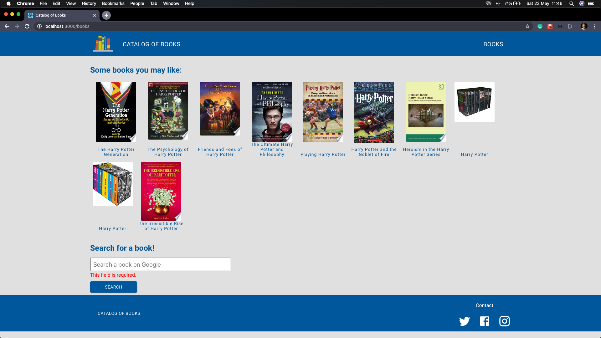
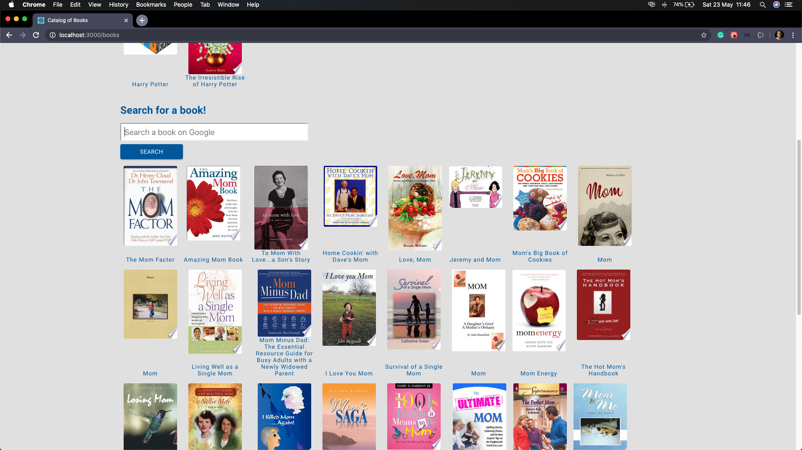

# Catalog of Books - Frontend

This is the frontend of the **Catalog of Books** project.

## About the project

- The **Catalog of Books** is an application where the user can search for books and then go to the proper webpage to buy it if they want to by clicking on the book, the user can also leave a review about the website and his/her experience.
- On the home page, the **_user_** can read some reviews about the website and can also leave your review by clicking in the button 'Write a Review!' below on the page.
- The **_user_** can search for books using the Books section on the navbar. Over there she/he will see some suggestions and search for those that he/she wants.

## The frontend

The frontend was developed with [**_ReactJS_**](https://reactjs.org/) with [**_React Hooks_**](https://reactjs.org/docs/hooks-intro.html), [**_axios_**](https://www.npmjs.com/package/axios) for the http requests on [**_Google_**] and REST to get the data (reviews) and to create new reviews in the local json-server.
[**_react-router-dom_**](https://www.npmjs.com/package/react-router-dom) was used to handle the routes in this application.
I also used [**_React Hook Form_**](https://react-hook-form.com/) to handle the errors in the input tags.

**Home Page**

**Home Page - Review**

**Review**

**Books**

**Search for a book**

## Getting started

1.  Prerequisites

- npm

      npm install npm@latest -g

2. Installation

- Clone the repo

      git clone https://github.com/euguilhermegirardi/Catalog-of-Books.git

3. Install NPM packages

       npm install

4. Run the application

       npm run start
       
5. Run the json-server

       json-server server.json -p 3001 -w -d 500

## Contributing

1.  Fork the project
2.  Create your feature branch (`git checkout -b feature/AmazingFeature`)
3.  Commit your changes (`git commit -m 'Add some AmazingFeature'`)
4.  Push to the branch (`git push origin feature/AmazingFeature`)
5.  Open a pull request

## License

